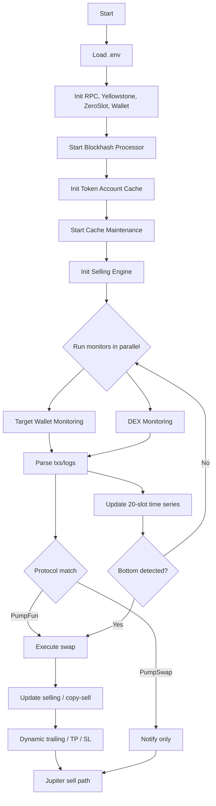

## Solana PumpFun/PumpSwap Raydium Copy/Sniper Trading Bot

High-performance Rust bot that monitors wallets and DEX activity on Solana and automatically copies/snipes trades. [contact me](https://t.me/av1080trading) PumpFun, PumpSwap,  Raydium launchpad, Raydium Cpmm, Raydium Amm, Meteora DBC and Meteora Damm. It integrates a configurable selling engine with dynamic trailing stops. Jupiter is used for token liquidation.

### Key Features

- **Real-time monitoring**: Yellowstone gRPC stream, parallel task processing
- **Protocols**: PumpFun (trade), PumpSwap (notify-only by default)
- **Copy trading**: Follow one or many target wallets with exclusions
- **Risk & selling**: Take profit, stop loss, dynamic trailing stop, copy-selling of existing balances
- **Tx landing**: Zeroslot or normal mode, configurable priority fees
- **Utilities**: Wrap/unwrap SOL, close empty token accounts, sell all tokens via Jupiter

---

### How it works (logic)

1. Load `.env`, build `Config` and initialize clients (RPC, Yellowstone, ZeroSlot, wallet).
2. Start the `BlockhashProcessor`, token-account cache, and cache maintenance.
3. Initialize `SellingEngine` from env and optionally start copy-selling for existing tokens.
4. Launch two monitors in parallel:
   - Target wallet monitoring (`processor/sniper_bot.rs`)
   - DEX monitoring (`processor/sniper_bot.rs`), protocol auto-detection or preference
5. Parse candidate transactions/logs, filter excluded addresses and apply limits.
6. Execute swaps. Apply slippage and priority-fee settings; optionally use ZeroSlot mode.
7. Manage positions with the selling strategy (TP/SL/dynamic trailing). Liquidation paths use Jupiter.
8. Maintain a per-token 20-slot time-series (price, buy/sell volume) to detect post-drop bottoms, enabling sniper entries and informed copy trades.



---

### Project structure

```
src/
  common/                # config, constants, logger, caches
  common/timeseries.rs   # 20-slot price & volume time-series, bottom detection
  library/               # blockhash processor, jupiter client, rpc, zeroslot
  processor/             # monitoring, swap/execution, selling, risk mgmt, parsing
  dex/                   # protocol adapters: pump_fun.rs, pump_swap.rs, raydium_launchpad.rs
  block_engine/          # helpers for token accounts & txs
  error/                 # error types
  main.rs                # entrypoint & CLI helpers (wrap/unwrap/sell/close)
```

Important files:

- `src/main.rs`: starts services, parallel monitors, CLI helpers (`--wrap`, `--unwrap`, `--sell`, `--close`).
- `src/common/config.rs`: loads env, builds `Config`, RPC/yellowstone clients, wallet, slippage, fees.
- `src/processor/sniper_bot.rs`: wallet/DEX monitoring orchestration.
- `src/processor/selling_strategy.rs`: selling engine with dynamic trailing stop.
- `src/library/jupiter_api.rs`: quotes and executes swaps for liquidation.
- `src/library/blockhash_processor.rs`: keeps recent blockhashes updated.

---

### Setup

Prerequisites:

- Rust toolchain (stable), Cargo
- Access to a Solana RPC (`RPC_HTTP`) and Yellowstone gRPC endpoint

1) Clone and create env file

```bash
cp src/env.example .env
# Edit .env with your keys and endpoints
```

2) Build

```bash
cargo build --release
```

3) Run

```bash
cargo run --release
```

CLI helpers (run one at a time):

```bash
cargo run --release -- --wrap      # Wrap WRAP_AMOUNT SOL to WSOL
cargo run --release -- --unwrap    # Unwrap WSOL back to SOL
cargo run --release -- --sell      # Sell all tokens via Jupiter
cargo run --release -- --close     # Close all token accounts (excl. WSOL with balance)
```

---

### Environment variables

Copy from `src/env.example` and adjust. Key settings (not exhaustive):

- Targeting & trading
  - `COPY_TRADING_TARGET_ADDRESS`: comma-separated wallet list to follow
  - `IS_MULTI_COPY_TRADING`: `true`/`false`
  - `EXCLUDED_ADDRESSES`: comma-separated addresses to ignore
  - `COUNTER_LIMIT`: max number of trades
  - `TOKEN_AMOUNT`: buy amount (qty if `SwapInType::Qty`)
  - `SLIPPAGE`: basis points (e.g. 3000 = 30%)
  - `TRANSACTION_LANDING_SERVICE`: `0|zeroslot` or `1|normal`

- Fees & priority
  - `SELLING_UNIT_PRICE`: priority fee for selling txs (default 4_000_000)
  - `SELLING_UNIT_LIMIT`: compute units for selling
  - `ZERO_SLOT_TIP_VALUE`: tip used in zeroslot mode

- Selling strategy
  - `COPY_SELLING_LIMIT`: initial multiple to start copy-selling
  - `TAKE_PROFIT`, `STOP_LOSS`, `MAX_HOLD_TIME`
  - `DYNAMIC_TRAILING_STOP_THRESHOLDS`: e.g. `20:5,50:10,100:30,200:100,500:100,1000:100`
  - `DYNAMIC_RETRACEMENT_PERCENTAGE`, `RETRACEMENT_PNL_THRESHOLD`, `RETRACEMENT_THRESHOLD`
  - `MIN_LIQUIDITY`
  - Time-series bottom detection (optional, future envs): `BOTTOM_MIN_DROP_PCT`, `BOTTOM_SELL_DECLINE_PCT`, `BOTTOM_STABILIZE_SLOTS`

- Sniper focus
  - `FOCUS_DROP_THRESHOLD_PCT`: fraction drop to mark token as dropped
  - `FOCUS_TRIGGER_SOL`: buy trigger size after drop (in SOL)

- Endpoints
  - `RPC_HTTP`: HTTP RPC endpoint
  - `RPC_WSS`: optional WSS endpoint
  - `YELLOWSTONE_GRPC_HTTP`: Yellowstone gRPC URL
  - `YELLOWSTONE_GRPC_TOKEN`: Yellowstone token
  - `ZERO_SLOT_URL`, `ZERO_SLOT_HEALTH`: ZeroSlot endpoints

- Wallet
  - `PRIVATE_KEY`: base58-encoded keypair string
  - `WRAP_AMOUNT`: SOL amount for `--wrap`

Example `.env` snippet:

```env
RPC_HTTP=https://rpc.shyft.to?api_key=YOUR_API_KEY
YELLOWSTONE_GRPC_HTTP=https://grpc.ny.shyft.to
YELLOWSTONE_GRPC_TOKEN=YOUR_GRPC_TOKEN
PRIVATE_KEY=YOUR_BASE58_PRIVATE_KEY

COPY_TRADING_TARGET_ADDRESS=ADDRESS1,ADDRESS2
IS_MULTI_COPY_TRADING=true
EXCLUDED_ADDRESSES=675kPX9MHTj...,CPMMoo8L3F...

TOKEN_AMOUNT=0.001
SLIPPAGE=3000
TRANSACTION_LANDING_SERVICE=zeroslot
SELLING_UNIT_PRICE=4000000
SELLING_UNIT_LIMIT=2000000
ZERO_SLOT_TIP_VALUE=0.0025

TAKE_PROFIT=8.0
STOP_LOSS=-2
MAX_HOLD_TIME=3600
DYNAMIC_TRAILING_STOP_THRESHOLDS=20:5,50:10,100:30,200:100,500:100,1000:100
```

---

### Notes

- PumpSwap is configured as notification-only by default. Extend `dex/pump_swap.rs` to enable execution.
- Ensure your `PRIVATE_KEY` is a base58 string of sufficient length; the app validates it at startup.
- If `SLIPPAGE` exceeds 10000 (100%), it is capped.

---

### License

For personal/educational use. Review and comply with your jurisdiction and exchange/DEX terms.
